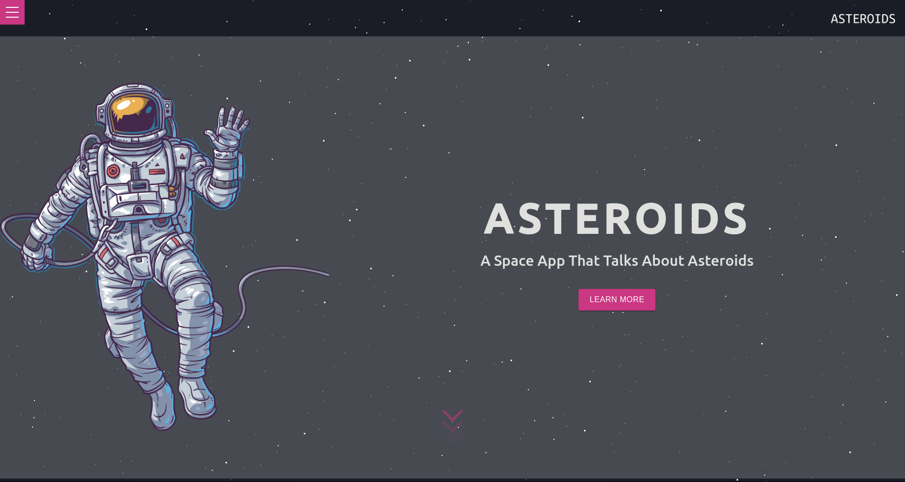

# Building an Asteroid app with React & Redux

## Technologies

- React
- React-DOM
- Create-React-App
- React Hooks
- React Router
- Eslint
- Firebase
- npm
- CSS
- Material UI

## Live Version 
<a href="https://asteroids-mo.netlify.app/" target="_blank" > Live version </a>

## Usage 

### Clone the project: 
 - git clone https://github.com/MouhaDiouf/asteroids
 
 ### Run the project
 - To install the dependencies run the command : npm install 
 - Register your Api Key by signing up on the <a href="https://api.nasa.gov/">API platform</a>. Then save that key into an .env file. Call it REACT_API_KEY.
  - After installation, run the command: npm start
 

## Description 

This app communicates with the Nasa API to display asteroids based on their IDs or date. It uses React on the front-end and Firebase on the backend. 

The user can create an account, browse through a list of asteroids, and add or remove asteroids from its favorites. The user can also have access to its favorite asteroids anytime he logs in.

## Developed by

Mouhamadou Diouf ( <a href="https://github.com/MouhaDiouf"> @mouhad </a>)

Let's connect on: 

-  <a href="https://www.linkedin.com/in/mouha-diouf/" target="_blank" > LinkedIn </a>
- <a href="https://twitter.com/mouhamadiouf" target="_blank"> Twitter</a>

You can also check <a href="https://mouhadiouf.com/" target="_blank"> my portfolio </a>

## Potential Future Improvements 

- Create admin dashboard for a user to manage its profile

## Contributing

1. Fork it (https://github.com/MouhaDiouf/asteroids)
2. Create your feature branch (git checkout -b feature/[choose-a-name])
3. Commit your changes (git commit -am 'What this commit will fix/add')
4. Push to the branch (git push origin feature/[chosen name])
5. Create a new Pull Request
